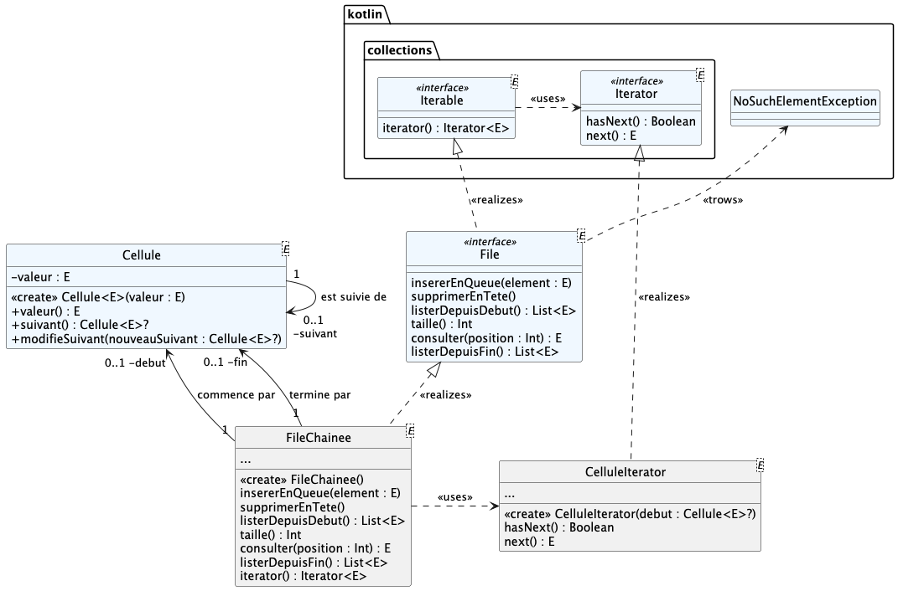
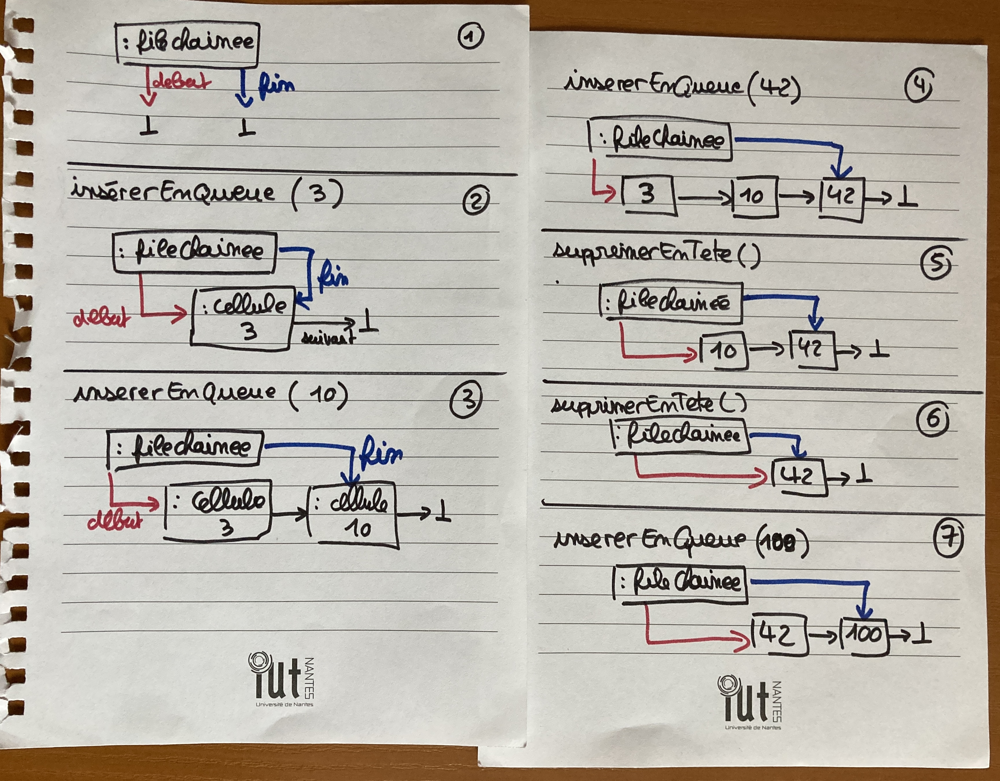
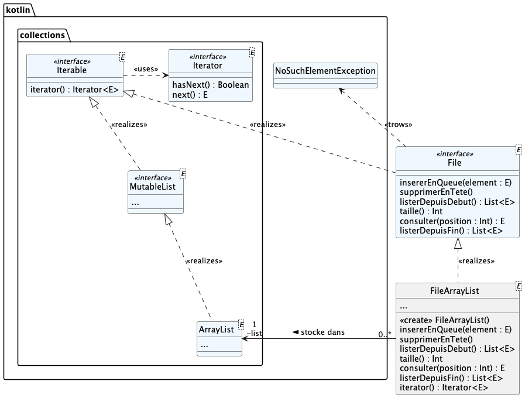

# qdev.dp.tp1 : (re-)prise en main de Kotlin et Algorithmique

## Tests Junit

Des fichiers de tests Junit vous sont fournis ; utilisez les pour valider votre développement au fur et à mesure.

- certains fichiers de tests concernent la "conformité" avec le diagramme de classes UML à implémenter
- certains fichiers de tests concernent l'usage correct d'une structure de données de type "File"

Renommez au-fur-et-à-mesure les fichiers  `.ktest` en `.kt` pour les inclure dans les fichiers à tester.

## Travail à réaliser

### question n°1

L'interface `File<E>` documente toutes les méthodes à implémenter.

La classe `Cellule<E>` est fournie.

Implémentez une file chainée `FileChainee<E>` comme décrite
par le diagramme de classes suivant :

Le fonctionnement attendu de la file chainée est illustré par les schémas suivants :

Les méthodes à implémenter sont documentées dans l'interface `File<E>`.

**ATTENTION :** laisser **en attente** l'implémentation de la méthode `iterator() : Iterator<E>` ; on y reviendra par la suite.

### question n°2

Proposez dans `FileArrayList<E>` une **autre** implémentation de l'interface `File<E>` 
utilisant cette fois sur une collection de type `MutableList<E>`, comme illustré par le diagramme de classes suivant :

__NB :__ modifiez les cas de tests `TestUsage***.kt` pour tester le fonctionnement cette nouvelle implémentation 

### question n°3

L'interface `File<E>` réalise l'interface `Iterable<E>` ; cela vous impose de fournir une méthode  `iterator() : Iterator<E>`
dans `FileChainee<E>`. Pour cela il vous faut implémenter une nouvelle classe `CelluleIterator` qui implémente l'interface `Iterator<E>`
et qui possède un attribut de type `Cellule<E>?` représentant la cellule courante.

### question n°4

Ecrivez un programme dans `Main.kt` permettant de "comparer" les deux implémentations proposées pour la `File<E>`. 

Réfléchissez à ce que peut signifier _"comparer"_ ?

**NB :** pour alimenter vos deux files avec des jeux "importants" de données, vous pouvez 
- générer des données aléatoires. 
- également "lire des mots" dans les fichiers texte présents dans `data/`.

### question n°5 (subsidiaire)

C'est à peine la rentrée ; certain(e)s d'entre vous ont peut-être été coincé encore récemment dans un bouchon à un péage.

Modéliser puis implémenter le comportement d'un péage autoroutier de "n" portiques de péage accueillant différents véhicules.

Vous pourrez "simuler" les différents événements : arrivée d'un nouveau véhicule, choix d'un portique, passage d'un véhicule à un portique, etc.

### question n°6 (subsidiaire)

Modifiez votre implémentation de  `FileChainee<E>` pour utiliser maintenant une liste doublement chainée : c-à-d que `Cellule<E>` connait maintenant sont prédécesseur en plus de son suivant.
Qu'est-ce que cela change pour `FileChainee<E>` ?
