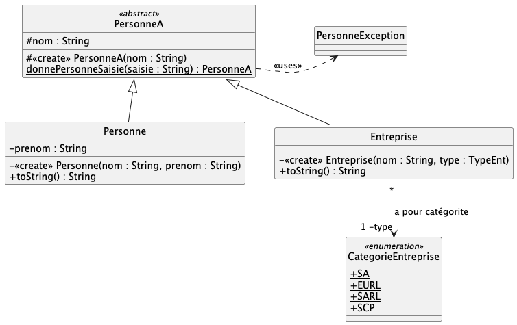
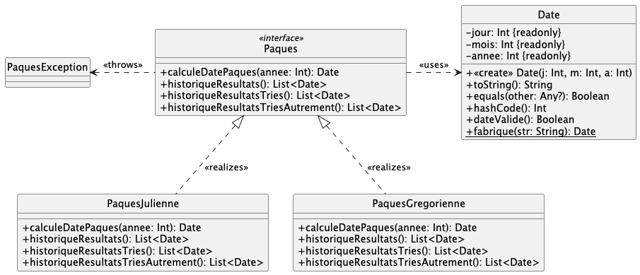

# qdev.dp.tp2

Des fichiers de tests Junit vous sont fournis ; utilisez les pour valider votre développement au fur et à mesure.

Renommez au-fur-et-à-mesure les fichiers .ktest en .kt pour les inclure dans les fichiers à tester.

## Exercice n°1 : Factory

Il va s'agir d'implémenter l'exercice n°1 traité lors du TD précédent.

### Question 1

Dans `StringExt.kt`, implémentez les deux méthodes d'extension indiquées.

> NB : on rajoute des fonctionnalités "utilitaires" à la classe `String`.

### Question 2

Dans `PersonneA` implémentez la factory `donnePersonneSaisie(texteSaisi : String)`. Des cas de tests vous sont fournis.

### Question 3

Utilisez la factory dans `Formulaire.kt` afin de créer une Personne ou une Entreprise à partir
de la chaine saisie dans `texteSaisi`, puis afficher la personne créée par la factory dans `resultat`.

### Question 4

Améliorez le formulaire en gérant correctement l'exception `PersonneException` ; par exemple, en affichant
une fenêtre de dialogue d'erreur :

        JOptionPane.showMessageDialog(jframe,message,titre,JOptionPane.ERROR_MESSAGE)

## Exercice 2 : calcul de la date de Pâques

_"Pâques est le dimanche qui suit la première pleine lune du printemps,
c'est-à-dire, selon la définition établie par le Concile de Nicée en 325 :
Pâques est le dimanche qui suit le 14e jour de la Lune qui atteint cet âge
le 21 mars ou immédiatement après."_

Il y a plusieurs algorithmes permettant de calculer la date de Pâques
en fonction de quelle Pâques on parle :
**la Pâques du calendrier Julien** ou **la Pâques du calendrier Grégorien**

voir : [wikipedia date de Pâques](https://fr.wikipedia.org/wiki/Calcul_de_la_date_de_P%C3%A2ques)

L'interface `Paques` définit plusieurs fonctionnalités
qu'il vous faudra implémenter, tout au long du projet : 
les méthodes à implémenter sont documentées dans l'interface `Paques`.

### Question 1

Implémenter la méthode `calculeDatePaques(annee: Int): Date` pour
la classe `PaquesJulienne` ;

Documentation [wikipedia "Paques julienne"](https://fr.wikipedia.org/wiki/Calcul_de_la_date_de_P%C3%A2ques_selon_la_m%C3%A9thode_de_Meeus#Calcul_de_la_date_de_P%C3%A2ques_julienne) ;

Des cas de tests dans `TestPaquesJulienne` vous permettent de valider votre développement.

### Question 2

Implémenter la méthode `calculeDatePaques(annee: Int): Date` pour
la classe `PaquesGregorienne` ;

Documentation [Wikipedia "Paques gregorienne"](https://fr.wikipedia.org/wiki/Calcul_de_la_date_de_P%C3%A2ques_selon_la_m%C3%A9thode_de_Meeus#Calcul_de_la_date_de_P%C3%A2ques_gr%C3%A9gorienne) ;

Des cas de tests dans `TestPaquesGregorienne`
vous permettent de valider votre développement.

### Question 3

Ajoutez une **fabrique** `choixPaques(choix : String) : Paques` pour obtenir une instance de `Paques` en fonction
du choix de l'utilisateur (`"julienne"` ou `"gregorienne"`) ; une exception sera levée dans tous les cas d'erreurs ; 
où placer cette fabrique ? mettez à jour le diagramme de classes

> Modifiez le fichier `ressources/paques.plantuml`.
>
> Je doute que vous puissiez installer et faire fonctionner le plugin plantuml pour IntelliJ
> mais vous pouvez utiliser l'[editeur en ligne pour PlantUML](https://www.plantuml.com/plantuml/)

Des cas de tests dans `TestFabriqueChoixPaques` vous permettent de valider votre développement.

### Question 4

Implémenter la méthode `historiqueResultats() : List<Date>`.

> cette méthode donne la liste de toutes les dates de Pâques calculées avec l'objet courant ;
> il faut donc ajouter un nouvel attribut pour stocker les dates calculées (i.e. appel à `calculeDatePaques()`)

On veut éviter d'implémenter 2 fois la même chose dans les classes `PaquesJulienne` et `PaquesGregorienne`.
Comment faire ? mettez à jour le diagramme de classes.

Des cas de tests dans` TestHistorique` vous permettent de valider votre développement.

### Question 5

Donner des cas de tests pour tester l'implémentation
de la méthode `dateValide() : Boolean` dans la classe `Date`.

> On commence par établir et coder des cas de tests avant de réaliser
> l'implémentation = TDD(Test Driven-Development)**.

### Question 6

Implémenter la méthode `dateValide() : Boolean`.

### Question7 [subsidiaire]

Implémenter la méthode `fabrique(str : String): Date`
dans la classe `Date`.

### Question8 [subsidiaire]

Implémenter les méthodes `historiqueResultatsTries() : List<Date>`
et `historiqueResultatsTriesAutrement() : List<Date>`;
Des cas de tests dans` TestHistoriqueTrie`
vous permettent de valider votre dev. 