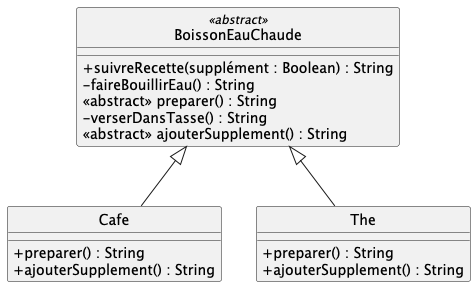
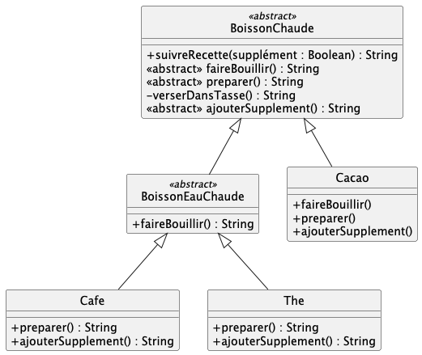
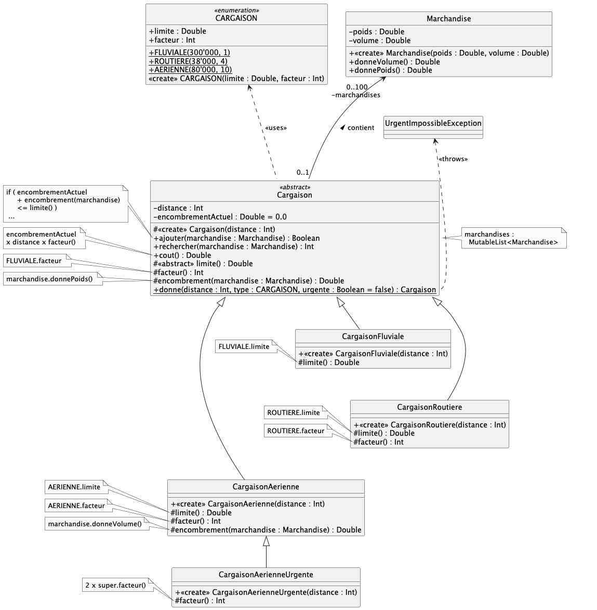

# qdev.dp.tp3

Des fichiers de tests Junit vous sont fournis ; utilisez les pour valider votre développement au fur et à mesure.

Renommez au-fur-et-à-mesure les fichiers  .ktest en .kt pour les inclure dans les fichiers à tester.

## Exercice n° 1 : Thé ou café ?

### Refactoring 

En partant des classes `The` et `Cafe` fournies, modifiez les pour refléter la conception vue en TD.

*Attention :* les cas de tests vous imposent les bons noms pour les classes et les méthodes à ajouter/modifier.

Voir aussi le diagramme UML suivant :

### Evolution du besoin

On ajoute maintenant une classe `Cacao`. Faites evoluer votre code en cohérence avec la conception vue en TD.

Voir aussi le diagramme UML suivant :

## Exercice n°2 :  Cargaison

Il va s'agir d'implémenter l'exercice traité lors du TD n°4.

Complétez les classes fournies en vous référant au diagramme de classes ;
implémentez correctement toutes les méthodes demandées ; Des cas de tests sont fournis.

## Pour aller plus loin 

On va maintenant rendre `Iterable` la classe `Cargaison`.

Ajoutez l'interface `Iterable<Marchandise>` à `Cargaison`.

C'est la classe `Cargaison` qui devra implémenter la méthode `iterator()`. Par défaut, IntelliJ reporte l'erreur sur les sous-classes de `Cargaison`. 

>Pour rendre `Iterable` la classe `Cargaison`, on pourrait <strike>utiliser l'iterator de l'attribut `marchandises`</strike>, 
mais ce ne serait pas très pédagogique.

Implémentez une classe `MarchandiseIterator` comme suit :

- implémentez cette classe **DANS** la classe `Cargaison` ;
- la classe `MarchandiseIterator` devra réaliser l'interface `Iterator<Marchandise>` ;
- Le constructeur prendra un paramètre `cargaison` indiquant la cargaison sur laquelle il faudra itérer ;
- la classe aura un attribut `cargaison` indiquant la cargaison sur laquelle il faudra itérer
- la classe aura un attribut `nbTotalMarchandises` indiquant le nombre de marchandises contenu dans la cargaison à itérer ;
- la classe aura un attribut `nbMarchandisesIteree`, indiquant le nombre de marchandises itérées jusqu'ici ;
- implémentez les méthodes `hasNext()` et `next()` pour la classe `MarchandiseIterator`.

Implémentez maintenant la méthode `iterator()` dans `Cargaison`.

Des cas de tests vous sont fournis dans pour vous permettre de valider votre implémentation.

