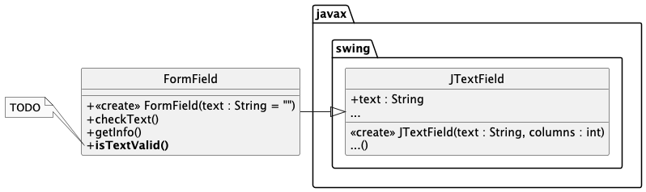
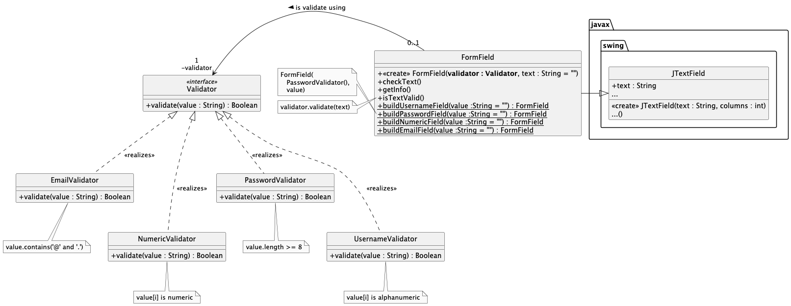
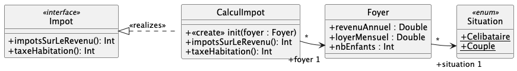
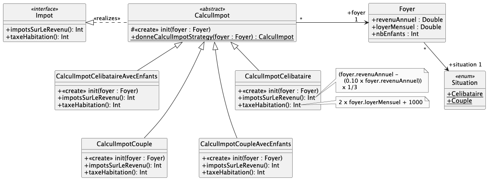
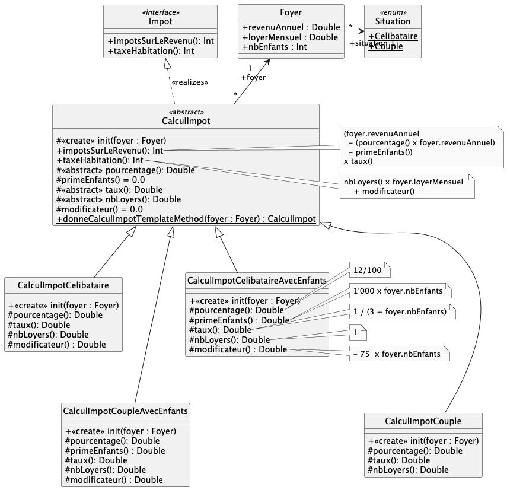
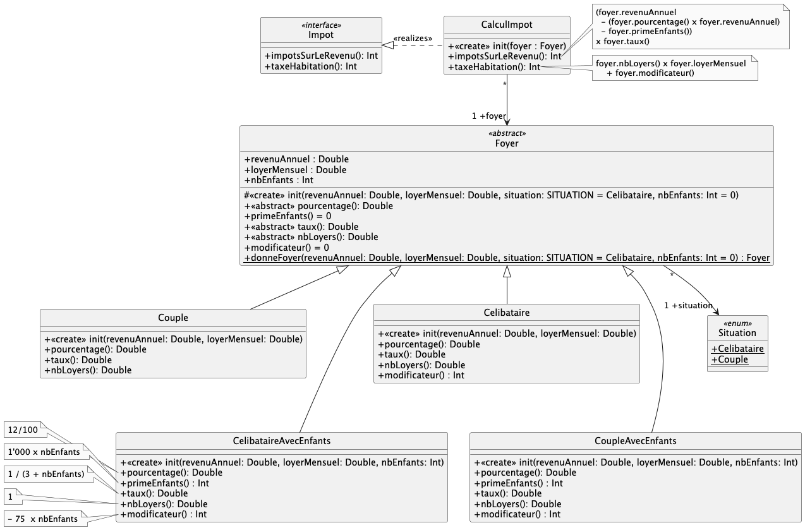

# qdev.dp.tp4

## Exercice n°1

Il va s'agir d'implémenter l'exercice 1 du TD n°4. Le problème de départ était le suivant :

La solution proposée est :

Des cas de tests JUnit vous sont fournis dans le package `testexo1`.
Renommez les fichiers `.ktest` en `.kt` pour qu'ils soient pris en compte.

Vous pouvez aussi tester votre implémentation en lançant la classe `Main.kt` (clic droit -> Run `MainKt`),
Attention, le programme affiche des messages dans la console.

> [!INFO]
> Pour que `Main.kt` s'exécute correctement, il faut
> 1. tapez : `xhost +` dans un terminal _Silverblue_;
> 2. ajoutez comme `Environment variables` : `DISPLAY=:0` dans la configuration du runner de `MainKt`

Notez la présence d'une classe `FormFieldObserver` dans la classe `FormField` : quel design pattern est ici illustré ? 

## Exercice n°2

Il va s'agir d'implémenter l'exercice 2 du TD n°4. La spécification UML de départ est la suivante :

_Dans le package `exo2.sans`, vous trouverez une implémentation **fonctionnelle** qui n'utilise pas de design patterns,
afin
de vous permettre de comparer les solutions_

### Solution avec le design pattern _Strategy_

Dans le package `exo2.strategy`, implémentez la solution utilisant le design pattern _Strategy_.

Des cas de tests JUnit vous sont fournis dans le package `testexo2.strategy`.
Renommez les fichiers `.ktest` en `.kt` pour qu'ils soient pris en compte.

### Solution avec le design pattern _Template Method_

Dans le package  `exo2.templatemethod`, implémentez la solution utilisant le design pattern
_Template method_.

Des cas de tests JUnit vous sont fournis dans le package `testexo2.templatemethod`.
Renommez les fichiers `.ktest` en `.kt` pour qu'ils soient pris en compte.

### Solution avec le design pattern _Strategy_ appliqué sur la classe `Foyer`

Dans le package  `exo2.strategyfoyer`, implémentez la solution utilisant le design pattern
_Strategy_ appliqué sur la classe `Foyer`.

Des cas de tests JUnit vous sont fournis dans le package `testexo2.strategyfoyer`.
Renommez les fichiers `.ktest` en `.kt` pour qu'ils soient pris en compte.

### Comparaison des solutions

Comparez les 4 solutions (sans design pattern, avec _Strategy_ sur `CalculImpot`, avec _Template Method_ sur
`CalculImpot`,
et avec _Strategy_ sur `Foyer`), en terme de compréhension du code, de maintenabilité, d'évolutivité, etc.

## Pour aller plus loin

- Implémentez un `Validator` pouvant **combiner** plusieurs `Validator` (ex : `AndValidator`, `OrValidator`,
  `NotValidator`, etc.)
- Dans l'exercice n°1, modifiez les règles de validation pour qu'elles correspondent vraiment à des règles réelles ?
- Modifiez/augmentez les cas de tests en conséquence
- Ajoutez de nouveaux `Validator` et implémentez les cas de tests en conséquence
- ...