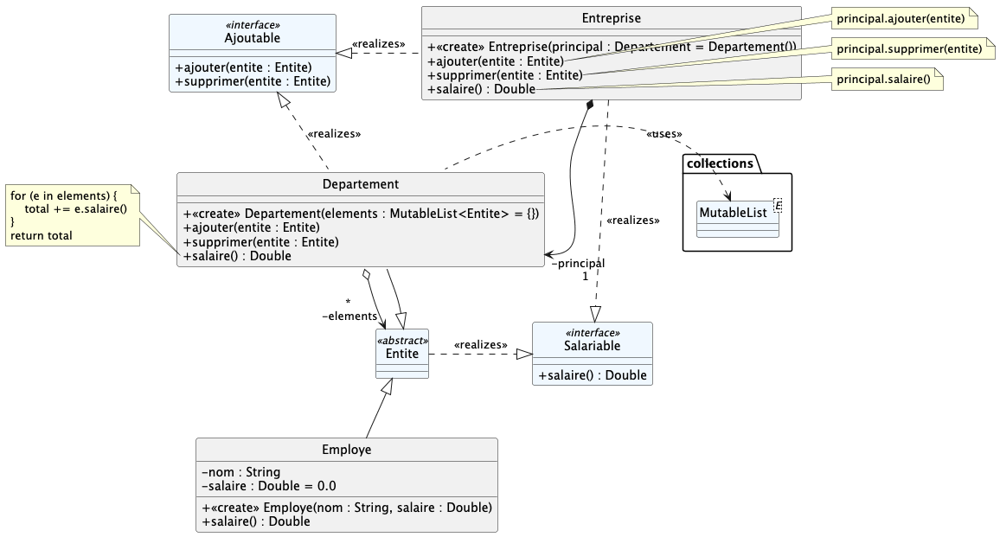
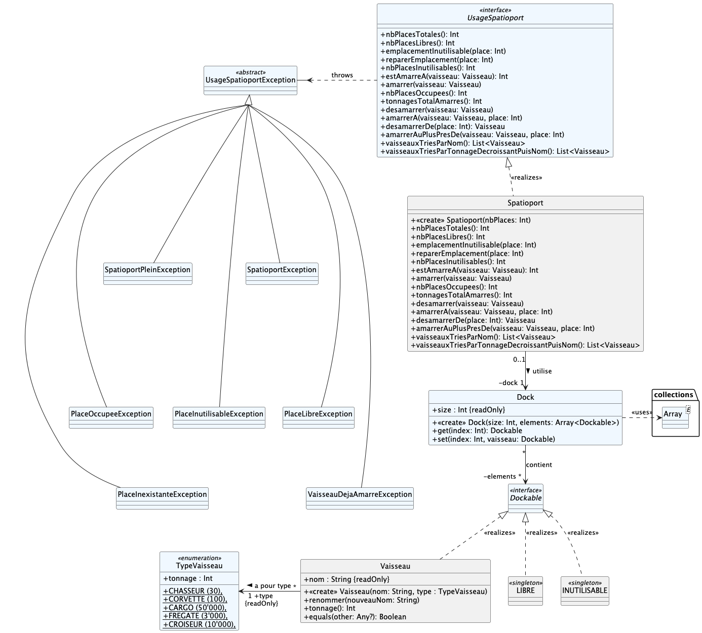
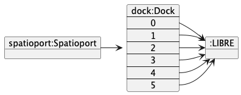
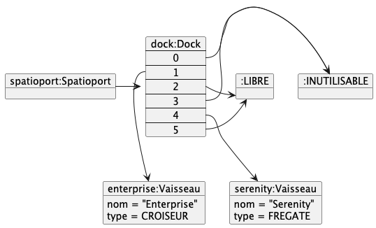

# qdev.dp.tp5


## Exercice n°1 : Composite + Delegate

Il va s'agir d'implémenter l'exercice n°1 du TD n°5.

La spécification UML est la suivante :



Les classes en BLEU sont fournies et ne doivent pas être modifiées.

Complétez les classes afin d'implémenter correctement
les design patterns _Composite_ et _Delegate_

- `Employe` et `Departement` forment un _Composite_
- `Departement` _délègue_ à `MutableList` l'implémentation de l'interface `Ajoutable`
- `Entreprise` _délègue_ à `Departement` l'implémentation des interfaces `Salariable` et `Ajoutable` : utilisez
  l'opérateur Kotlin `by`

> [!IMPORTANT]
> Des cas de tests vous permettent de valider votre implémentation (`.ktest`-> `.kt`).

#### Pour aller plus loin...

> [!NOTE]
> Revenir à cette question si vous terminez l'exercice n°2 en avance.

Ajoutez une méthode `listeEmployes() : List<Employe>` aux classes `Departement` et` Entreprise`
qui retourne la liste (à plat) de tous les employés de l'entreprise/département/sous-département.

Ajoutez des cas de tests validant cette nouvelle méthode.

## Exercice n°2 : Singleton et Entrepôt de données

Implémentez correctement la spécification UML suivante :



Les classes en BLEU sont fournies et ne doivent pas être modifiées.

Les classes `LIBRE` et `INUTILISABLE` doivent être des Singletons Kotlin.

Le `Spatioport` est une sort *d'entrepôt* de vaisseaux ; pour stocker des vaisseaux, le `Spatioport` utilisera (en interne) un `Dock`, mais sans le divulger (principe d'encapsulation) ; 
les méthodes **métier** que doit implémenter `Spatioport` sont documentées dans
l'interface `UsageSpatioport`. 

> [!TIP] 
> L'opérateur Kotlin `as` pourrait peut-être vous être utile ; il permet de `convertir' un objet vers sa classe réelle.
> Par exemple :

```kotlin
val nimporteQuoi : Any = Personne("Jean", "Dupont")
...
(nimporteQuoi as Personne).renommer("Jacques")
```


Le comportement attendu pour un spatioport est illustré par le scénario suivant :

```kotlin
val spatioport = Spatioport(6)
```

donne



```kotlin
spatioport.amarrerA(Vaisseau("Serenity", FREGATE), 4)
spatioport.emplacementInutilisable(3)
spatipoport.emplacementInutilisable(0)
spatioport.amarrer(Vaisseau("Enterprise", CROISEUR))
```

donne



> [!IMPORTANT]
> Des cas de tests vous permettent de valider votre implémentation :
> 
> 1) Les `TestUml*.kt` vérifient la cohérence de votre code avec la spécification UML données ;
> 2) `TestSingletons.kt` vérifie que `LIBRE` et `INUTILISABLE` sont bien des singletons ; 
> 3) `TestEgaliteVaisseaux` vérifie l'égalité/inégalité entre vaisseaux ;
> 4) Les `TestUsage*.kt` vérifie le fonctionnement du spatioport ; commencez par renommer `TestSpatioportBase.ktest -> TestSpatioportBase.kt`, 
> avant tout renommage d'un `TestUsage*.ktest`