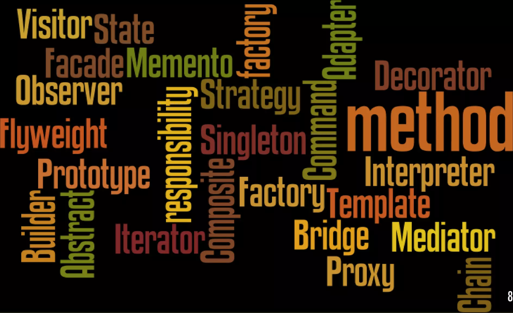

# R3.04 : Design Patterns

[Ressource R2.01 : Développement Orienté Objets](https://gitlab.univ-nantes.fr/iut.info1.dev.objets/dev.objets.ressources)

[Tutoriel IntelliJ](https://gitlab.univ-nantes.fr/iut.info1.dev.objets/dev.objets.tutoriel.intellij.idea)

## Supports de cours

[Introduction](CMs/00-intro.pdf) (07/09/2026)

[Rappels Kotlin](CMs/01-kotlin.rappels.pdf) (07/09/2026)

<!-- 
[Design patterns](CMs/02-design-patterns.pdf) 
(**MAJ 13/10/2025**)

[Nouveautés Kotlin](CMs/03-kotlin.nouveau.pdf) 
(10/09/2025)

[Nouveautés Kotlin : lamdba-fonctions, etc.](CMs/05-kotlin.nouveau.lambda.pdf) (13/10/2025)
-->

## TPs

[TP n°1 : (re-) prise en main de Kotlin = implémentation d'une file chaînée](https://gitlab.univ-nantes.fr/iut.info2.qdev.dp/etudiants/qdev.dp.tp1)

<!--
[TP n°2 : implémentation d'une factory (Personne vs. Entreprise) + algorithmes Date de Pâques (Strategies)](https://gitlab.univ-nantes.fr/iut.info2.qdev.dp/2024-2025/qdev.dp.tp2)

[TP n°3 : implémentation de template methods (thé ou café + cargaisons)](https://gitlab.univ-nantes.fr/iut.info2.qdev.dp/2024-2025/qdev.dp.tp3)

[TP n°4 : découverte de KTor](https://gitlab.univ-nantes.fr/iut.info2.qdev.dp/qdev.dp.ressources/-/wikis/TP-SAE-:-d%C3%A9couverte-de-KTor)

[TP n°5 : strategies et template methods, Iterators](https://gitlab.univ-nantes.fr/iut.info2.qdev.dp/2024-2025/qdev.dp.tp5)

[TP n°6 : Composite, delegate et Singleton](https://gitlab.univ-nantes.fr/iut.info2.qdev.dp/2024-2025/qdev.dp.tp6)

[TP n°7 : Seralisation, DAO et Repository](https://gitlab.univ-nantes.fr/iut.info2.qdev.dp/2024-2025/qdev.dp.tp7)

[TP n°8 : tables de hachage](https://gitlab.univ-nantes.fr/iut.info2.qdev.dp/2024-2025/qdev.dp.tp8)

[TP n°9 : DAO](https://gitlab.univ-nantes.fr/iut.info2.qdev.dp/2024-2025/qdev.dp.tp9)

-->

## Références

[https://refactoring.guru/design-patterns](https://refactoring.guru/design-patterns)

[https://github.com/takaakit/uml-diagram-for-kotlin-design-pattern-examples](https://github.com/takaakit/uml-diagram-for-kotlin-design-pattern-examples)

[https://github.com/kelvindev15/Kotlin2PlantUML](https://github.com/kelvindev15/Kotlin2PlantUML)

<!--

## Problème IntelliJ/Maven (2023-2024)

configurer le proxy  pour la VM Java utilisé par Maven : 
dans  `~/.var/app/com.jetbrains.IntelliJ-IDEA-Community/config/JetBrains/IdeaIC2024.2/idea64.vmoptions`
ou`
`~/.var/app/com.jetbrains.IntelliJ-IDEA-Ultimate/config/JetBrains/IntelliJIdea2024.2/idea64.vmoptions`

    -Xmx2048m
    -Dhttps.proxyHost=srv-proxy-etu-2.iut-nantes.univ-nantes.prive
    -Dhttps.proxyPort=3128

Configurer le proxy pour IntelliJ
dans `~/.var/app/com.jetbrains.IntelliJ-IDEA-Community/config/JetBrains/IdeaIC2024.2/options/proxy.settings.xml` 
ou 
`~/.var/app/com.jetbrains.IntelliJ-IDEA-Ultimate/config/JetBrains/IntelliJIdea2024.2/options/proxy.settings.xml`

    <application>
    <component name="HttpConfigurable">
        <option name="USE_HTTP_PROXY" value="true" />
        <option name="PROXY_HOST" value="srv-proxy-etu-2.iut-nantes.univ-nantes.prive" />
        <option name="PROXY_PORT" value="3128" />
    </component>
    </application>

-->