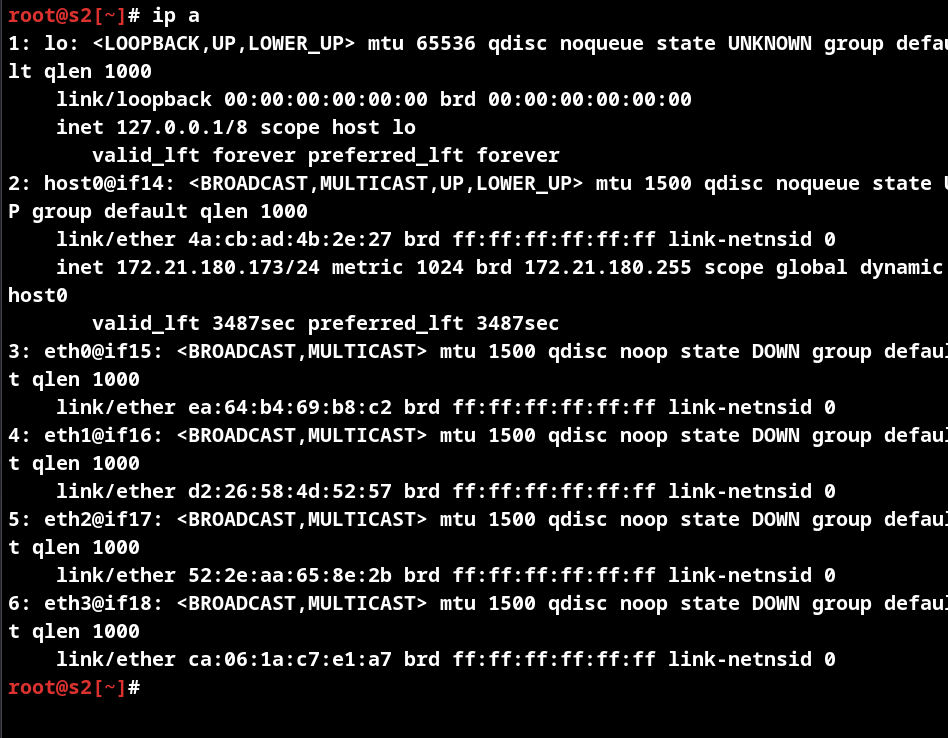
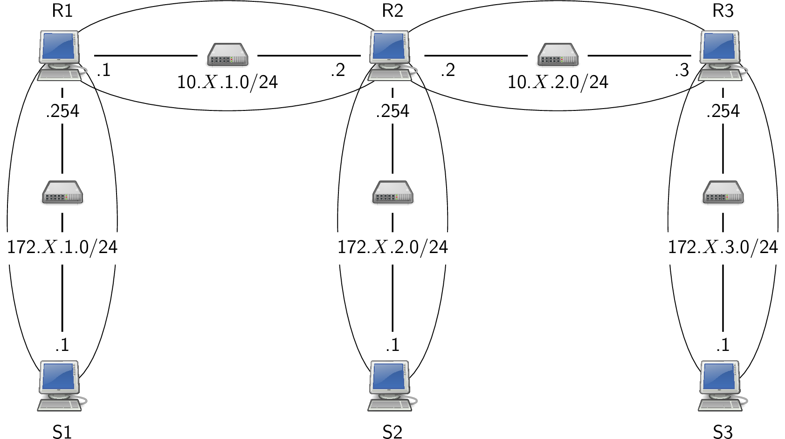
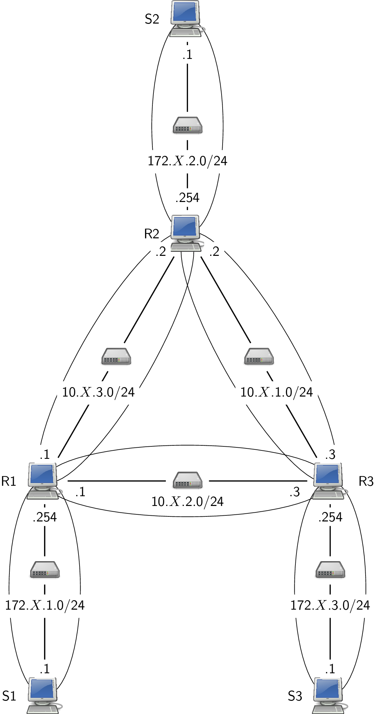

# Td Architecture des réseaux : Routage

Le `X` des adresses IP qui suivent est à remplacer par le numéro de prise ou le numéro de la machine dans la salle.

## Préambule

Comme en R2.05, vous allez travailler sur des machines virtuelles pour les TPs réseaux de cette année. Ce premier TP vise à rafraîchir quelques connaissances de base en réseau et manipuler l'environnement réseau local.

Vous disposez de la possibilité d'ajouter des machines virtuelles via la commande `vm-add`.

* consultez le manuel de `vm-add`
* ajoutez trois machines virtuelles **debian** nommées respectivement `S1`, `S2` et `R1`.
* consultez le manuel de `vm-ls`
* listez les machines virtuelles disponibles
* consultez le manuel de `vm-run`
* démarrez `S1` et `S2`

## 1 Rappels

### 1.1 Adresse IP

Chaque interface réseau (i. e. carte réseau) d'un hôte du réseau 
possède (au moins) une adresse IP unique dans le réseau. Une 
interface ethernet peut être désignée par un nom ”traditionnel” comme ethX où X est le numéro de l'interface ou un nom ”prédictible” comme enp0s25. 
Une adresse IP est un nombre de 32 bits souvent noté en décimal pointé ; 
quatre entiers (compris entre 0 et 255) séparés par des points. 
Exemple : 192.168.2.200. L'adresse IP est structurée en deux 
parties : 

1. partie réseau : permet de désigner le réseau (netID)

2. partie hôte : permet de désigner l'hôte dans le réseau 
  (hostID)

Un masque de sous-réseau permet de séparer partie réseau et 
partie hôte. Ce masque ; une succession de 1 suivi d'une 
succession de 0 donne l'étendue de la partie réseau.

* mettre la partie host à 0 nous donne l'adresse du réseau. Ceci 
  se fait par un et bit à bit entre adresse IP et masque. Exemple 
  pour 192.168.2.200 avec un masque de 255.255.224.0 : 
    
```
192.168.2.200     11000000.10101000.00000010.11001000

     ET                           ET

255.255.224.0     11111111.11111111.11100000.00000000

     =                             =

192.168.0.0       11000000.10101000.00000000.00000000
```

* mettre tous les bits de la partie réseau à 0 nous donne la 
  partie hôte. 

* mettre tous les bits de la partie hôte à 1 nous donne l'adresse 
  de diffusion dans le réseau.

### 1.2 Routage

Un hôte voulant faire une transmission constitue un paquet IP qui 
contient l'adresse du destinataire et l'adresse de l'expéditeur. 
Au niveau de la couche réseau, le routage utilise une table de 
routage qui contient une ou plusieurs lignes contenant chacune 
essentiellement trois informations : 

1. une adresse de réseau

2. un masque de réseau

3. comment atteindre le réseau : soit directement par une 
  interface connectée sur ce réseau (on parle de routage direct 
  ou de remise directe), soit en passant par un routeur (on parle 
  de routage indirect) qui est identifié par son IP et 
  l'interface à utilisée pour l'atteindre.

Un routeur peut être un équipement spécialisé ou simplement un 
hôte ordinaire relié à plusieurs réseaux.

Le décision de routage se fait par la recherche d'une 
correspondance dans la table de routage en appliquant pour chaque 
ligne, le masque de réseau à l'adresse de destination. Quatre cas 
peuvent alors se présenter : 

1. le réseau de la destination est directement connecté. Il y une 
  remise directe en utilisant le réseau local sous-jacent.

2. le réseau de la destination est accessible via un routeur. Le 
  paquet est transmis au routeur sans changer les adresses IP de 
  l'émetteur et du destinataire.

3. le réseau de la destination est absent de la table de routage, 
  mais il existe une route par défaut. Le paquet est transmis au 
  routeur désigné.

4. le réseau de la destination est absent de la table de routage, 
  et il n'existe pas de route par défaut. Envoi d'un message ICMP 
  à l'émetteur : `Network is unreachable`

Chaque routeur recevant un paquet IP applique le même algorithme.

### 1.3 Type de routage

Les deux types connus de routage sont : 

1. le routage statique

2. le routage dynamique ou auto-adaptatif

Par routage statique, on entend que les tables de routage sont 
renseignées manuellement, par opposition au routage dynamique où 
celles-ci sont construite par application d'un algorithme 
distribué au niveau des routeurs.

### 1.4 Commandes

Les commandes réseaux sont présentes sous deux formes :

* les commandes vénérables : `ifconfig`, `arp` et `route` que nous n'allons pas utiliser

* la nouvelle commande `ip` (du paquet iproute2) : `ip link`, `ip addr`, `ip neigh` 
  et `ip route`


#### interface

consultation : `ip link`, activation d'une interface `eth1` : `ip link set eth1 up`

#### adressage

consultation : `ip addr`, configuration d'une interface `eth0` : `ip addr add 192.168.1.1/24 dev eth0`

#### voisinage

consultation  : `ip neigh`

#### routage

consultation : `ip route`, configuration : ajout avec `add`, suppression avec `del` ; route par défaut : `default`. Exemple :

```
ip route add 172.20.11.0/24 via 192.168.1.253
```

## 2 Configuration réseau

Observez la configuration réseau initiale de `S1`. 

* Combien d'interfaces réseaux sont-elles disponibles ? 
 avec la commande ip a pour moi les differnetes interface , il y en a 6 
<!-- il faut faire ip a 
-->
* Quelle(s) est(sont) vos ip ? 
<!-- 172.21.180.104/24  dans le -->
* Qu'avez-vous comme route(s) ? ip
<!-- j'ai une route pour l'ip 172.21.180.173 et 172.21.180.1 
 -->
* Quels type de liens sont disponibles ? 
<!-- j'ai un lien avec le localhost , le BROADCAST et les autre  interfaces  -->
* Quelles sont vos adresses MAC ? 
<!-- j'ai l'adresse mac 00:00:00:00:00:00 sur le broadcast et  02:cc:15:db:33:f3 sur le broadcast  -->
* Quel est l'état du cache arp ?
<!--  -->
* ajoutez les ip `192.168.X.101/24` sur `s1` et `192.168.X.102/24` sur `s2` en utilisant dans les deux cas l'interface `eth3`
<!-- -->
* lancer un `ping` (qui génère un trafic ICMP `echo request/echo reply` permettant de tester la connectivité) entre `S1` et `S2`
<!-- il faudra verifier que l'interface et ouverte sur chaque machine apres faire le ping 
-->
* reconsultez l'ensemble des informations.


Il est également possible de capturer le traffic réseau sur une machine.
* consultez le manuel de `vm-tcpdump`
* lancez un `ping` entre `S1` et `S2`
* utilisez la commande  `vm-tcpdump` pour observer le traffic ICMP
<!-- vm-tcpdump s1 eth3 -->

## 3 Routage statique

Il est rappelé que bien souvent, les stations ordinaires 
(qui ne sont pas des routeurs) se contentent d'UNE IP sur UNE 
interface avec UNE route par défaut.

### 3.1 Situation 1


* configurez les interfaces des trois stations (normalement, vous 
  avez 4 interfaces à configurer). Il faut **impérativement** utiliser des interfaces homologues (i.e. de même nom) si vous voulez les faire communiquer.

* consultez les tables de routages des trois stations

* avec la commande `ping`, depuis `S1`, déterminez quelles sont les 
  communications possibles et impossibles vers les 4 interfaces. 
  Expliquez

* Dans `S1`, ajoutez une route permettant d'atteindre le réseau 
  `172.X.2.0/24`

* Attention le `forwarding` (la fonction de retransmission d'un 
paquet) peut ne pas être actif. Pour en consulter la valeur, deux possibilités existent :
  * `cat /proc/sys/net/ipv4/ip_forward`
  * `sysctl net.ipv4.ip_forward`

pour modifier cette valeur, deux possibilités existent :
 
* `echo 1 > /proc/sys/net/ipv4/ip_forward` (que fait cette commande ?)
* `sysctl net.ipv4.ip_forward=1`

`sysctl` peut permettre de pérenniser la modification. (Dé)commentez la ligne `net.ipv4.ip_forward=1` dans le fichier `/etc/sysctl.conf`. Puis recharger la configuration, `sysctl -p`

* ajoutez la route ”retour” sur `S2`
<!-- ip r  a 172.31.1.0/24 via 172.31.2.254
-->
* testez

* Sur `S1` et `S2`, supprimez les routes ajoutées et mettez seulement des routes par défaut
<!-- ip r a default via 172.31.2.254
-->
* testez

### 3.2 Situation 2




#### Mettez en place la situation :

* configurez les interfaces 

* configurez le routage

* testez

## 4 Routage dynamique




Configurer `S1`, `S2` et `S3` avec ip et route par défaut. Dans la suite, seuls **les routeurs** sont à modifier.

Nous allons utiliser la suite logicielle `frr` qui fournit les protocoles de routage dynamique les plus courants : OSPF, RIP et BGP, ...  et transforme un système linux en routeur. `frr` est un *fork* de `quagga` (lui même fork de *zebra*) qui utilise un design multi-démons (un par protocole de routage, par exemple `ospfd` pour OSPF), coordonnés par un démon central `zebra`. `frr` gère les décisions de routage et s'appuie sur le noyau Linux pour le transfert des paquets. Il est possible de le configurer comme on le ferait pour un routeur matériel (type Cisco) via un terminal, à chaud ou avec des fichiers de configuration. La consultation de l'état du routeur se fait, elle aussi depuis un terminal particulier : `vtysh`.

Commencez par par installer `frr` : 

```
apt update --allow-realeaseinfo-change
apt install frr
```

### 4.1 OSPF

* Pour configurer le routage ospf, deux fichiers sont à produire/modifier sur chacun des routeurs :

1. Le fichier `/etc/frr/daemons` permet de spécifier les démons de routage à activer. Pour notre cas : 

```
...
ospfd=yes
...
```

2. Le fichier [`/etc/frr/frr.conf`](frr.conf). Ce fichier est fourni avec `A` numéro du routeur en cours de configuration, `B` et `C` numéro des deux autres routeurs (à adapter !!). On y configure les adresses IP : `interface N` puis `ip address`. Ospfd calcule le coût des routes en se servant de la bande passante d'une interface.  Il est possible de la définir pour chaque interface de manière à avoir un coût "conforme" : `bandwidth valeur`. On configure dans le même fichier le routeur ospf : `router ospf`, on déclare les réseaux sur lesquels chercher des routeurs voisins `network ... area 0`


* droits pour ce fichier

```
chown frr:frr /etc/frr/frr.conf && chmod 640 /etc/frr/frr.conf
```

* pour les logs 

```
mkdir -p /var/log/frr && chown frr:frr /var/log/frr 
```

* lancez `frr`

```
systemctl restart frr
```

* vérifiez le lancement des démons (`ps ...`)

* testez (ping)

* n'hésitez pas à capturer avec `vm-tcpdunp` pour observer les échanges

* consultez les tables de routages (`vtysh` puis `show ip route` ou `vtysh -c "show ip route"`)

```
R1> show ip route 

Codes: K - kernel route, C - connected, S - static, R - RIP, O - OSPF, I - ISIS, B - BGP, > - selected route, * - FIB route

...

O 10.1.2.0/24 [110/1] is directly connected, interface, 00:02:30
...
```

Notez le [110/1] qui indique la priorité d'une route ospf par rapport aux autres sources des routes (0 connecté, 1 static , 20 BGP, 110 ospf et 120 RIP) et le 1 le coût du lien.

Faites la même chose depuis un terminal : 

* `ip route` 

* consultez les information du routeur `ospf` (`vtysh`, puis `show ip ospf` avec éventuellement `neighbor` ou `route` en complément) 

* faites un ping entre `S1` et `S2`

* utilisez `traceroute  -n` pour constater le chemin emprunté (éventuellement avec `-I`)

* simulez la couper d'un lien entre `R1` et `R2`, soit en désactivant une interface (~ débranchement de câble), soit en bloquant le traffic ospf, par exemple avec `iptables` 

* vérifiez que tout fonctionne toujours

* constatez l'évolution des tables de routage ou la perte de voisins
